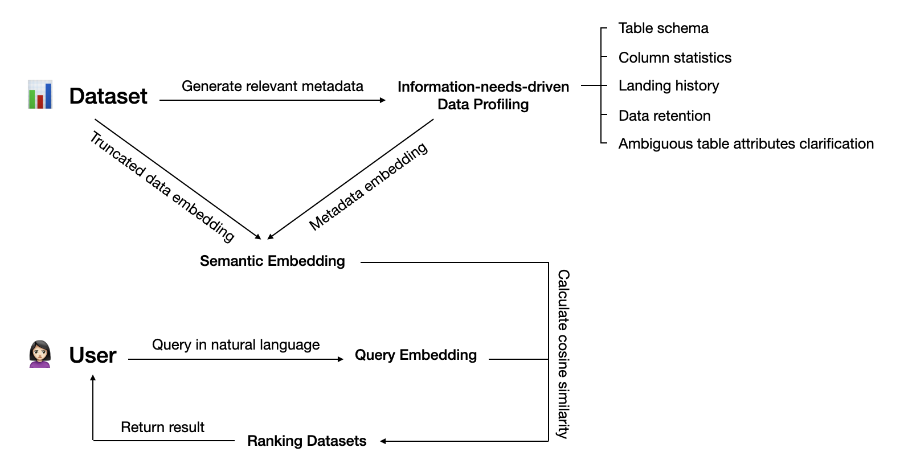

# LLM-Powered Semantic Dataset Search Engine

## Description

This project is a web application that enables users to perform semantic and keyword-based searches on datasets. It leverages a vector database [`weaviate`](https://weaviate.io/) for semantic understanding and provides a user-friendly interface for data interaction, with [`pagila`](https://github.com/devrimgunduz/pagila) as the sample dataset.

## System Pipeline



Our system pipeline employs an LLM-powered approach for efficient dataset discovery, catering to specific user information needs. It includes data profiling, natural language query processing, dataset embedding, and dataset ranking based on semantic relevance.

## Prerequisites

- Python 3.x
- Docker
- Virtual environment

## Installation

```bash
git clone https://github.com/Gitcatmeoww/llm-powered-semantic-dataset-search-engine.git
cd llm-powered-semantic-dataset-search-engine
pip install -r requirements.txt
```

## Usage

To start the server, run:

```bash
docker-compose up -d
source venv/bin/activate
python run.py
```

Navigate to http://localhost:5000 in your web browser to access the application.

## License

This project is licensed under the [MIT License](LICENSE) - see the LICENSE file for details.
